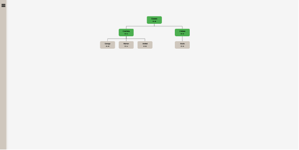

# EmployeeManagementApp

This is my very first serious web application. This app is used for managing human resources. The backend is built with Node and the frontend is with React. 
For authentication and sessions the app uses a passport strategy for google authentication.

This is the database schema. The db is made in MySql.
And some more screenshots from the app.

